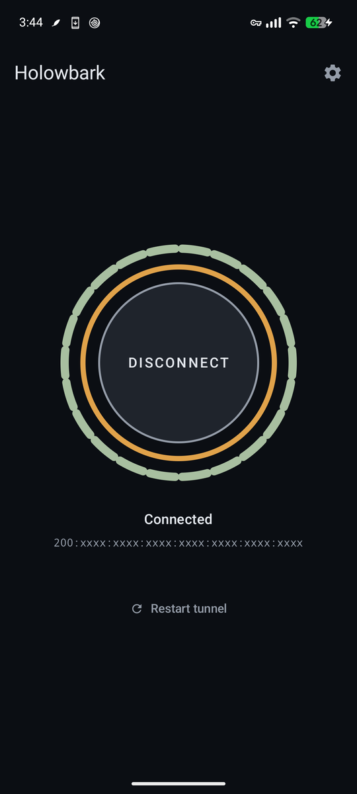
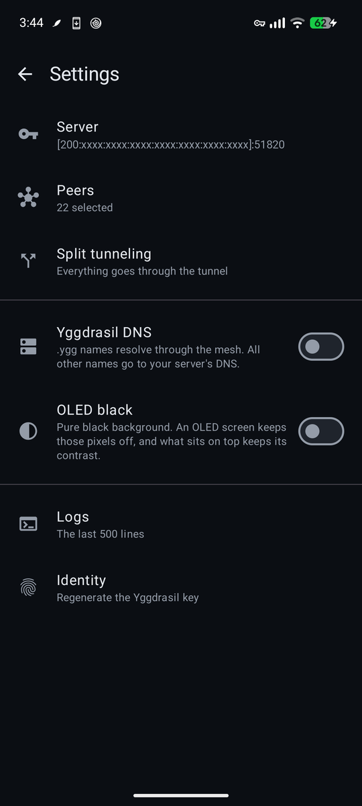
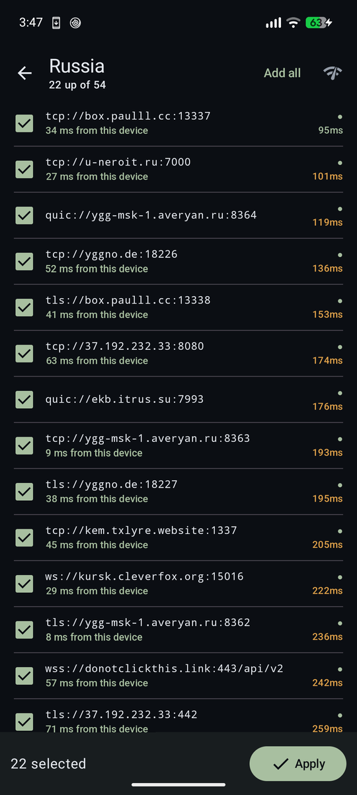
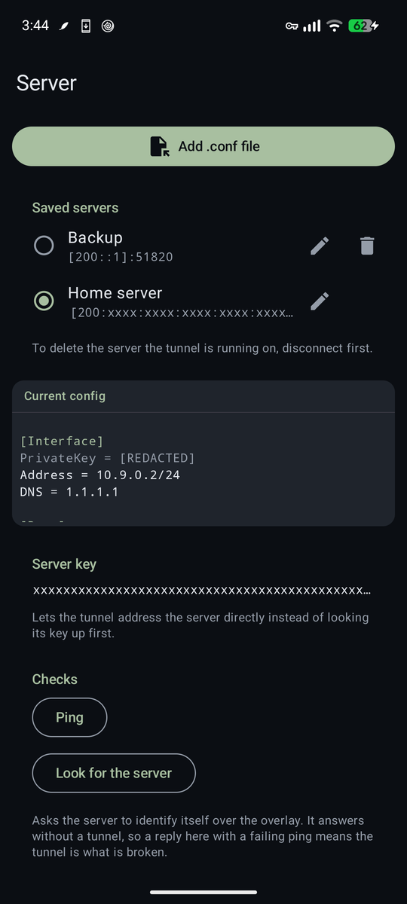

# Holowbark

[Русский](README.md)

An Android WireGuard client that reaches its server through the
[Yggdrasil](https://yggdrasil-network.github.io/) overlay network instead of the
open internet. No root required.

The point is a server with **no reachable port**. Its WireGuard port is firewalled
off from the public internet, and the only way in is its Yggdrasil address — an
address that exists only inside the mesh. There is nothing on a public IP to scan,
fingerprint, or block.

Pre-built APKs are in [Releases](https://github.com/SilentAutomaton/holowbark/releases).

<p align="center">
  
  
  
  
</p>

## How a packet travels

```
  your app
     │
     ▼
  TUN interface  ──────────────────────────────────────┐
     │                                                 │
     │ destination in 200::/7?                         │ everything else
     ▼                                                 ▼
  Yggdrasil overlay                            WireGuard / AmneziaWG
     │                                                 │
     │                            encrypted WG frames ─┘
     │                                     │
     │  wrapped in IPv6/UDP and sent ◄─────┘
     ▼
  physical network → mesh → your server
```

Two tunnels are stacked. WireGuard encrypts your traffic as usual, but it has no
socket of its own: its protocol frames are handed back to the app, wrapped in an
IPv6 UDP datagram addressed to the server's overlay address, and carried by
Yggdrasil. Traffic already destined for the overlay skips WireGuard entirely.

Yggdrasil's own peer addresses are excluded from the tunnel routes when it starts,
so the transport that carries the tunnel does not run through it.

## Status and limitations

- **AmneziaWG obfuscation parameters are parsed and passed through, but untested.**
  Plain WireGuard configs are the tested path.
- Android 8.0 (API 26) and later. Below API 33 the peer exclusions are expressed as
  split routes, which is slower to set up but works the same.
- The tunnel is only as reachable as the overlay: with no connected Yggdrasil
  peers, nothing connects. Ten or more peers is a reasonable starting point.

## Quick start

1. Press **Add server** and import your WireGuard `.conf` file. If you do not have
   a server yet, set one up with the instructions below.
2. On the first run the app already picked the public peers of the country your
   phone is in: the ones the public list reports up, or all of them when the list
   cannot be fetched. To change them, open **Settings → Peers** and either browse
   the public list — **Add all** and **Remove all** take a whole country at once —
   or type in a peer of your own: your Yggdrasil node, or one on your LAN.
3. Go back and press **Connect**.

The public list reports peers as its crawler sees them, from its own network. The
button next to **Add all** checks every peer of a country from the phone itself;
then **Add all** takes the peers that answered here. The check runs only while the
tunnel is down, because with the tunnel up it would go through the tunnel.

**Settings → Server** keeps every `.conf` you import, under its file name. Pick
another server there; the switch takes effect at the next connect. Any server can
be renamed, and deleted unless the tunnel is running on it.

The ring around the button is the tunnel. Each segment of the outer ring is one
connected Yggdrasil peer, so you can watch the overlay assemble; the inner ring is
the WireGuard tunnel running through it, which comes up once the server answers a
ping through the mesh. If the tunnel stalls with the overlay up, **Restart tunnel**
retries it without tearing the overlay down.

## Server setup — manual

A WireGuard server reachable only through the overlay. Its UDP port is closed to
the public internet, and its Yggdrasil address is the sole entry point.

### 1. Yggdrasil

Packages for every platform are at
[yggdrasil-network.github.io/installation](https://yggdrasil-network.github.io/installation.html).
On Debian or Ubuntu:

```bash
curl -o /etc/apt/trusted.gpg.d/yggdrasil.gpg \
  https://neilalexander.s3.eu-west-2.amazonaws.com/deb/key.gpg
echo "deb https://neilalexander.s3.eu-west-2.amazonaws.com/deb/ debian yggdrasil" \
  > /etc/apt/sources.list.d/yggdrasil.list
apt update && apt install yggdrasil
yggdrasil -genconf > /etc/yggdrasil/yggdrasil.conf
systemctl enable --now yggdrasil
```

Add several public peers to the `Peers` array in `/etc/yggdrasil/yggdrasil.conf` —
the list is at [publicpeers.neilalexander.dev](https://publicpeers.neilalexander.dev/).
Then read the server's overlay address:

```bash
yggdrasilctl getSelf | grep '"address"'
# "address": "200:xxxx:xxxx:xxxx:xxxx:xxxx:xxxx:xxxx"
```

### 2. WireGuard

```bash
apt install wireguard-tools
echo "net.ipv4.ip_forward=1"          >> /etc/sysctl.d/99-forward.conf
echo "net.ipv6.conf.all.forwarding=1" >> /etc/sysctl.d/99-forward.conf
sysctl -p /etc/sysctl.d/99-forward.conf
```

### 3. Keys

```bash
SERVER_PRIV=$(wg genkey); SERVER_PUB=$(echo "$SERVER_PRIV" | wg pubkey)
CLIENT_PRIV=$(wg genkey); CLIENT_PUB=$(echo "$CLIENT_PRIV" | wg pubkey)
echo "Server public: $SERVER_PUB"
echo "Client public: $CLIENT_PUB"
```

### 4. Server config

Find the outbound interface with `ip route | awk '/^default/{print $5}'`, then
create `/etc/wireguard/wg0.conf`:

```ini
[Interface]
Address    = 10.100.0.1/24
ListenPort = 51820
PrivateKey = <SERVER_PRIV>
MTU        = 1420

# NAT; replace eth0 with your outbound interface
PostUp  = iptables -t nat -A POSTROUTING -s 10.100.0.0/24 -o eth0 -j MASQUERADE
PreDown = iptables -t nat -D POSTROUTING -s 10.100.0.0/24 -o eth0 -j MASQUERADE

# Close the port to the internet: IPv4 entirely, IPv6 except from Yggdrasil
PostUp  = iptables  -I INPUT -p udp --dport 51820 -j DROP; \
          ip6tables -I INPUT -p udp --dport 51820 ! -s 200::/7 -j DROP
PreDown = iptables  -D INPUT -p udp --dport 51820 -j DROP; \
          ip6tables -D INPUT -p udp --dport 51820 ! -s 200::/7 -j DROP

[Peer]
PublicKey  = <CLIENT_PUB>
AllowedIPs = 10.100.0.2/32
```

```bash
systemctl enable --now wg-quick@wg0
```

### 5. Client config for Holowbark

```ini
[Interface]
PrivateKey = <CLIENT_PRIV>
Address    = 10.100.0.2/24
DNS        = 1.1.1.1
MTU        = 1420

[Peer]
PublicKey           = <SERVER_PUB>
Endpoint            = [200:xxxx:xxxx:xxxx:xxxx:xxxx:xxxx:xxxx]:51820
AllowedIPs          = 0.0.0.0/0, ::/0
PersistentKeepalive = 25
```

`Endpoint` must be the server's Yggdrasil address from step 1 — that address is
what tells the app to route the tunnel over the overlay. Import the file under
**Settings → Server**.

Set `MTU` on both ends rather than leaving it to be inferred. `wg-quick` derives an
unset MTU from the route to the peer's endpoint, and a client whose endpoint is a
`200::` address resolves that route over Yggdrasil's interface — whose MTU is 65535.
A desktop `wg-quick` client therefore comes up at roughly 65455 unless told
otherwise. Holowbark itself defaults to 1420 and honours whatever the `.conf` says.

## Server setup — wg-easy (Docker)

[wg-easy](https://github.com/wg-easy/wg-easy) is a web interface for managing
WireGuard. Follow its
[installation guide](https://wg-easy.github.io/wg-easy/latest/getting-started/).
The only change for Holowbark is `WG_HOST`: use the server's Yggdrasil address
rather than its public IP.

```
WG_HOST=[200:xxxx:xxxx:xxxx:xxxx:xxxx:xxxx:xxxx]
```

Every client config the interface generates then carries the correct `Endpoint`.
Download the `.conf` and import it under **Settings → Server**.

Once setup is finished, close both ports to the public internet:

```bash
# WireGuard: IPv4 entirely, IPv6 except from Yggdrasil
iptables  -I INPUT -p udp --dport 51820 -j DROP
ip6tables -I INPUT -p udp --dport 51820 ! -s 200::/7 -j DROP

# Web interface: the same
iptables  -I INPUT -p tcp --dport 51821 -j DROP
ip6tables -I INPUT -p tcp --dport 51821 ! -s 200::/7 -j DROP

apt install iptables-persistent -y && netfilter-persistent save
```

The web interface then stays reachable from inside the overlay at
`http://[200:xxxx:...]:51821`, or through an SSH tunnel:

```bash
ssh -L 51821:localhost:51821 user@<server>
# then open http://localhost:51821
```

## Build

| Tool | Version |
|---|---|
| Go | 1.21 or later |
| gomobile | latest, installed with `go install golang.org/x/mobile/cmd/gomobile@latest` |
| Android SDK | platform-35, build-tools-35 |
| Android NDK | r27 (`ndk;27.2.12479018`) |
| Java | 17 or later |

```bash
make setup    # first time: SDK components, gomobile, pinned Go sources
make all      # holowbark.aar + debug APK
make install  # adb install to a connected device
```

Other targets:

```bash
make deps         # fetch the pinned Go sources and patch them
make aar          # holowbark.aar only
make apk          # debug APK (needs the aar)
make apk-release  # unsigned release APK
make rebuild      # clean-aar + all
make deps-reset   # re-fetch the Go sources from scratch
```

With `app/libs/holowbark.aar` already built, Gradle works directly:

```bash
./gradlew assembleDebug
./gradlew test              # unit tests, no device needed
adb install -r app/build/outputs/apk/debug/app-debug.apk
```

### The Go library

`holowbark.aar` bundles Yggdrasil and AmneziaWG in one archive — separate archives
would each carry their own copy of the gomobile `go.Seq` runtime and collide. It is
about 49 MB and is **not committed**; build it once with `make aar`.

Neither are the Go sources. `make deps` fetches them at the revisions pinned in the
`Makefile` (`YGG_REF`, `ANET_REF`) into `.deps/`, then applies the patches kept in
`deps/patches/`:

| Patch | What it changes |
|---|---|
| `yggdrasil-go/0001-…` | exports `SendToKey`, `KeyForAddress` and `ProbeNode` to the bindings, so the tunnel can address the server by its key instead of waiting for the address-to-key lookup |
| `yggdrasil-go/0002-…` | pins the dependencies that `contrib/awgmobile` and gomobile need |
| `anet/0001-…` | drops a `//go:linkname` pull of Go's private IPv6 zone caches |

Each patch opens with why it exists. The one machine-specific line — the `replace`
pointing at the patched anet — is written by `make deps`, not carried in a patch.

`contrib/awgmobile/awgmobile.go` is the gomobile entry point and the one Go file
this repository owns; `make deps` copies it into the checkout, because it has to
compile inside that module.

`.deps/` is a build artefact. `make deps` resets its tracked files to the pinned
revision before applying the patches, so an edit made there is gone on the next
build — it belongs in a patch. To add one: edit the checkout, capture it with
`git -C .deps/yggdrasil-go diff > deps/patches/yggdrasil-go/0003-….patch`, and the
next `make aar` picks it up. `make deps-reset` throws the checkouts away and fetches
them again.

## Architecture

```
app/src/main/kotlin/net/holowbark/
├── vpn/      the tunnel: service, both managers, router, codec, DNS proxy,
│            peer-URI parsing, the recovery watchdog
├── peers/    the public peer list — fetch, cache, parse
├── config/   WireGuard/AmneziaWG .conf parsing
└── ui/       Compose screens, navigation, view model, the connect ring
```

The whole Kotlin↔Go boundary is two files. `YggdrasilManager` wraps
`mobile.Yggdrasil` and `AwgManager` wraps `awgmobile.Backend`; nothing else touches
a native class, which is what keeps the rest of the code testable off-device.

`contrib/awgmobile/awgmobile.go` is what makes the stacking possible. It gives
AmneziaWG a channel-backed TUN and a channel-backed socket bind in place of the
real ones, so WireGuard's plaintext and its encrypted frames both surface in Kotlin
rather than going to the kernel — leaving the app free to route the frames over the
overlay.

Routing at the TUN:

| Destination | Path |
|---|---|
| `200::/7` (the overlay) | straight to Yggdrasil |
| `198.18.0.53:53` | the split-DNS proxy, when overlay DNS is enabled |
| everything else | the WireGuard tunnel |

Conventions for contributing are in [CODESTYLE.md](CODESTYLE.md).

## Troubleshooting

The **Logs** tab is the first place to look for all of these. It holds the last 500
lines and copies to the clipboard.

**Yggdrasil never leaves "Connecting".** No peer is answering. Add more peers on the
Peers screen, and prefer ones geographically close to you. Public peers go down
regularly, so a list that worked last month may be entirely dead.

**Yggdrasil is up but the tunnel layer stays "Pinging server…".** The overlay works
and your server is not answering on it. Check `systemctl status yggdrasil` on the
server, confirm `yggdrasilctl getSelf` reports the address in your `Endpoint`, and
confirm the WireGuard port is open to `200::/7` rather than closed to everything.

**Connected, but nothing loads.** Usually DNS. If the config's `DNS` server is only
reachable through the tunnel it may not answer; try `1.1.1.1`. If overlay DNS is on,
turn it off in Settings to narrow the problem down.

**`.ygg` names do not resolve.** Enable Yggdrasil DNS in Settings. It is off
by default because it sends every lookup through the overlay resolvers.

**Small pages load, large downloads stall.** An MTU mismatch: one end is emitting
packets the other will not accept, and nothing logs a drop. Set `MTU = 1420` on both
the server and the client `.conf`. The connect log line reports the MTU the app is
actually running at.

**It worked, then stopped after the screen was off for a while.** Exempt Holowbark
from battery optimisation. Android suspends the process otherwise, and the overlay
peers time out. The app repairs this by itself: when the server stops answering it
redials the peers and, if that is not enough, rebuilds the overlay. It probes only
while the tunnel is idle, so an actively used tunnel costs nothing.
